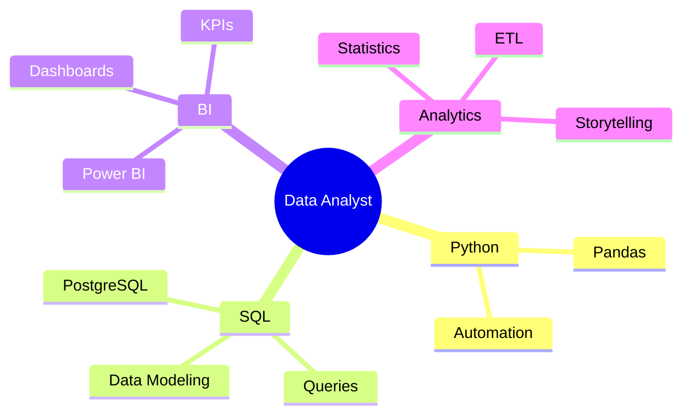

<div align="center">


<br>


<br> <br>

<p align="center">
  
  
  
</p>

<br>

<p align="center">

  <a href="www.linkedin.com/in/enya-arruda" target="_blank">
  
  </a>

   <a href="https://github.com/enyasofia-data" target="_blank">
  
   </a>

  <a href="https://github.com/enyasofia-data" target="_blank">
  
  </a>
</p>
</div>

---

<div align="center">

# 🪻about_me.exe

</div>

```python
class EnyaSofia:

    def __init__(self):
        self.role = "Future Data Analyst"
        self.language = ["Python", "SQL"]

        self.focus = [
            "Data Analysis",
            "Business Intelligence",
            "Data Visualization",
            "Dashboard Development",
            "ETL Processes"
        ]

    def mindset(self):
        return "Turning data into strategic decisions 💜"

````
<h2 align="center"> 💟 Sobre mim </h2> 

<p align="center"> Apaixonada por tecnologia, dados e visualização estratégica. </p>
<p align="center"> Data Analytics • Business Intelligence • Data Visualization </p> 
<p align="center"> Storytelling com Dados • Dashboards • Automação </p> 
<br> 

<div align="center">

| 📚 Atualmente estudando | ✨ Objetivo |
| :--- | :--- |
| Python • SQL • Power BI | Transformar dados em decisões inteligentes |
| ETL • Estatística • Modelagem | Conquistar minha primeira oportunidade em dados |

</div>

<br> 

<div align="center"> 
  
 
</div>
<br> 

---
<div align="center">

# 🌐 DEVELOPMENT BACKGROUND


</div>
<br>

<div align="center">


</div>

<p align="center">
Experiência prévia com desenvolvimento web e aplicações utilizando
C#, ASP.NET, HTML, CSS, JavaScript e Bootstrap.
</p>

<p align="center">
💜 Atualmente direcionando minha carreira para Data Analytics e Business Intelligence.
</p>

</div>


---


<div align="center">

# 📊 ANALYTICS STACK


</div>

<br>

<div align="center">


</div>

---

<div align="center">

# 📊 GITHUB INTELLIGENCE DASHBOARD

</div>

<div align="center">


<br><br>


</div>

---

<div align="center">

# 🧠 DATA SKILLS MATRIX

</div>

<div align="center">

| 💡 Área                  | 🚀 Tecnologias                         |
| ------------------------ | -------------------------------------- |
| 📈 Data Visualization    | Power BI, Looker Studio                |
| 🐍 Data Analysis         | Python, Pandas                         |
| 🗄️ Databases            | SQL, PostgreSQL, MySQL, SQLite          |
| ⚙️ Tools                 | Git, GitHub, VS Code                   |
| 📊 Business Intelligence | Dashboards, KPIs, Storytelling         |
| 🔄 Data Processing       | ETL, Cleaning, Pipelines               |
| 🧠 Analytics             | Insights, Trends, Performance Analysis |

</div>

---

<div align="center">

# 🚀 FEATURED PROJECTS

</div>

<div align="center">

<a href="https://github.com/enyasofia-data/PROJETO1">

</a>

<a href="https://github.com/enyasofia-data/PROJETO2">

</a>

<br><br>

<a href="https://github.com/enyasofia-data/PROJETO3">

</a>

<a href="https://github.com/enyasofia-data/PROJETO4">

</a>

</div>

---

<div align="center">

# 🌱 CURRENT LEARNING PATH

</div>

<div align="center">



</div>

---

<div align="center">

# 🐍 CONTRIBUTION SNAKE

<picture>
  <source media="(prefers-color-scheme: dark)" srcset="https://raw.githubusercontent.com/enyasofia-data/enyasofia-data/output/github-contribution-grid-snake-dark.svg">
  
</picture>

</div>

---

<div align="center">

<br><br>

<div align="center">

☕ powered by coffee & curiosity

</div>

<br><br>

> ✨ *"Data is the new language of intelligent decisions."*


</div>

<br>


